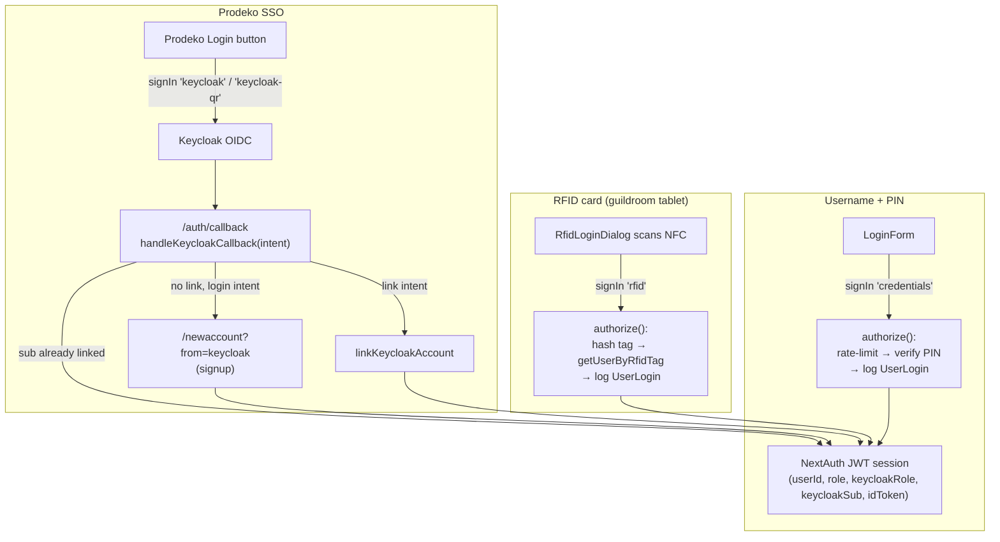

# Authentication & Authorization

Namukilke uses **[NextAuth v4](https://next-auth.js.org/)** with a **JWT
session strategy**. There are three ways to sign in:

| Method           | Provider                   | Where it's used                                      |
| ---------------- | -------------------------- | ---------------------------------------------------- |
| Username + PIN   | `credentials`              | Everywhere                                           |
| Prodeko SSO      | `keycloak` / `keycloak-qr` | Anywhere a member wants to use their Prodeko account |
| RFID access card | `rfid` (credentials)       | The guildroom tablet only                            |

**The only way to sign in as an Admin should be the Prodeko login. Users having admin roles in the namukilke DB is a deprecated approach and will be removed in the future.**

## Login flows

### RFID login (guildroom tablet)

The guildroom tablet shows an **RFID Login** button only when the device is
detected as the guildroom tablet (`deviceType === RFID_ALLOWED_DEVICE_TYPE`). This login method currently only allows using the user's Namu DB role (`User.role`) for authorization.

### Prodeko SSO (Keycloak)

Two Keycloak providers share one issuer: `keycloak` (standard redirect) and
`keycloak-qr` (used on the guildroom tablet, where the QR client lets a member
authenticate by scanning a code with their phone). This sign-in method can be used for admin logins.

- **Login** (default intent) — if the Keycloak account is already linked to a namu
  account, the session resolves to that user.
- **Signup** — if there's no link, the user is sent to `/newaccount?from=keycloak`
  to create a namu account, which is then linked.
- **Link** — if the user clicked "Link Prodeko" on their account page while
  already logged in, `beginKeycloakLink` stashed their userId in a short-lived
  signed HttpOnly cookie; the callback consumes it and creates the link.

## Authorization: two role sources

A session's **effective role** is the strongest of two sources:

1. **`User.role`** in the namu database (the namukilke role), and
2. **Keycloak roles** read from the access-token JWT claims.

Keycloak roles are mapped as follows:

| Keycloak role          | App role     |
| ---------------------- | ------------ |
| `namukilke-admin`      | `ADMIN`      |
| `namukilke-superadmin` | `SUPERADMIN` |

**Role staleness:** both the DB role and the Keycloak role are _snapshots taken
at sign-in_. Changing a role in Keycloak (or in the namu DB) takes effect at the
user's **next login**.
